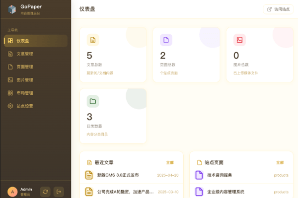

# GoPaper 使用指南

GoPaper 是一款面向小企业官网的静态内容管理系统。它把内容（文章、页面、图片）和网站外观（模板、布局）拆开来管理，让你不用写代码就能搭建和维护一个简洁、专业的企业网站。



---

## 目录

- [快速开始](#快速开始)
- [管理后台](#管理后台)
- [内容管理](#内容管理)
  - [文章](#文章)
  - [页面](#页面)
- [图片管理](#图片管理)
- [布局管理](#布局管理)
- [站点设置](#站点设置)
- [常见问题](#常见问题)

---

## 快速开始

### 1. 启动服务

在终端进入项目目录后执行：

```bash
./gopaper
```

默认会监听 `http://127.0.0.1:3000`。

首次启动前，请确认 `config.toml` 中配置了 `JWT_SECRET`。如果还没配置，可设置一个随机字符串，例如：

```toml
JWT_SECRET = "your-random-secret-here"
```

### 2. 进入管理后台

打开浏览器访问：

```
http://127.0.0.1:3000/admin
```

使用 `config.toml` 中 `[admin]` 段配置的账号密码登录。

### 3. 查看网站

访问 `http://127.0.0.1:3000/` 即可看到企业官网首页。

---

## 管理后台

后台左侧是主导航：

- **仪表盘**：查看站点统计概览。
- **文章管理**：发布新闻、博客、动态。
- **页面管理**：创建公司介绍、产品服务、联系我们等独立页面。
- **图片管理**：上传图片，获取 Markdown 引用地址。
- **布局管理**：管理模板和页面区域，实现灵活排版。
- **站点设置**：修改网站标题、描述、联系方式、首页横幅等。

---

## 内容管理

### 文章

文章通常用于发布新闻动态、博客、案例等内容。

1. 进入 **文章管理** → 点击 **新建文章**。
2. 填写标题、作者、日期、标签等基本信息。
3. 在正文区域用 Markdown 编写内容。
4. 点击 **保存**。

文章会按目录（如 `news`）自动归档，并在对应列表页展示。

### 页面

页面用于展示公司简介、产品服务、联系我们等固定内容。

1. 进入 **页面管理** → 点击 **新建页面**。
2. 填写标题、Slug（网址标识，可留空自动生成）。
3. 选择 **布局位置**（可选），用于把页面放到首页的不同区域，例如横幅区、功能区、新闻区等。
4. 设置 **排序权重**，数值越小越靠前。
5. 编写 Markdown 正文并保存。

---

## 图片管理

1. 进入 **图片管理**。
2. 拖拽或点击上传图片。
3. 上传成功后，点击图片可复制 Markdown 引用地址：

```markdown

```

把地址粘贴到文章或页面正文中即可。

---

## 布局管理

布局管理是 GoPaper 的核心能力，用来控制网站的模板和页面区域。

### 模板

一个模板对应一个 HTML 页面文件。系统默认提供：

- **首页模板**（`index.html`）：包含横幅区、功能区、新闻区、联系区。
- **列表模板**（`list.html`）：用于文章/新闻列表页。
- **文章模板**（`article.html`）：用于单篇文章/页面详情页。

### 区域

每个模板下面可以定义多个区域。区域是页面上的一块内容位置，例如：

- `hero`：横幅区
- `features`：功能区
- `news`：新闻区
- `contact`：联系区
- `main`：主内容区

### 把页面放到指定区域

1. 在 **布局管理** 里确认模板已有需要的区域。
2. 进入 **页面管理**，编辑某个页面。
3. 在 **布局位置** 下拉框中选择目标区域。
4. 保存后，该页面就会按权重排序显示在对应区域。

### 排序方向

每个目录可以在其 `_meta.toml` 中配置 `SORT_ORDER`：

```toml
SORT_ORDER = "asc"   # 升序，权重小的在前（默认）
SORT_ORDER = "desc"  # 降序，权重大的在前
```

### 选择模板

目录的 `_meta.toml` 中可以用 `LAYOUT` 指定使用的模板：

```toml
LAYOUT = "home"
```

不指定时，系统会根据目录类型使用默认模板。

---

## 站点设置

站点设置保存在 `content/_meta.toml` 中，常用字段如下：

```toml
SITE_TITLE = "GoPaper"              # 网站标题
SITE_DESC = "专业的企业级解决方案提供商"  # 网站描述
HERO_TITLE = "引领数字化转型"         # 首页大标题
HERO_SUBTITLE = "为企业提供全方位的技术解决方案"  # 首页副标题
HERO_CTA_TEXT = "了解我们的服务"      # 首页按钮文字
HERO_CTA_LINK = "/products"         # 首页按钮链接
NEWS_TITLE = "新闻动态"              # 新闻区标题
NEWS_LINK = "/news"                 # 新闻区"查看全部"链接
CONTACT_EMAIL = "contact@example.com"
CONTACT_PHONE = "400-123-4567"
CONTACT_ADDRESS = "北京市朝阳区"
```

这些设置会实时反映在网站首页。

---

## 常见问题

### 修改后网站没有变化？

尝试强制刷新浏览器：`Cmd + Shift + R`（Mac）或 `Ctrl + Shift + R`（Windows/Linux）。

### Logo 或 Favicon 怎么换？

把新的 SVG 文件放到 `web/public/` 目录下：

- Logo：`web/public/logo-teal.svg`
- Favicon：`web/public/favicon.svg`

替换后重新构建并刷新页面即可。

### 新增页面后没有显示？

- 确认页面已保存。
- 确认页面所属目录类型正确（页面应放在 `page` 类型目录下）。
- 如果设置了布局位置，确认该区域在当前模板中存在。

### 忘记密码怎么办？

修改 `config.toml` 中 `[admin]` 段的 `PASSWORD` 为 bcrypt 加密后的新密码，然后重启服务。

---

## 技术说明

- 内容文件存放在 `content/` 目录，每篇文章是一个 Markdown 文件加 TOML 前置元数据。
- 图片上传后保存在 `uploads/` 目录。
- 模板文件存放在 `web/templates/` 目录。
- 布局配置保存在 `web/templates/layouts.toml`。
